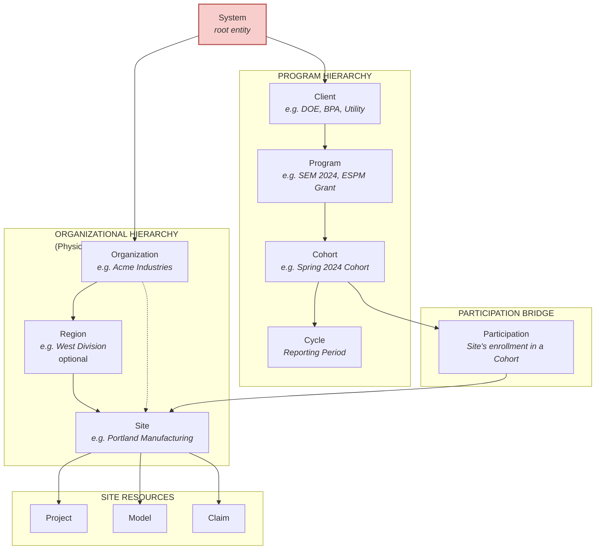
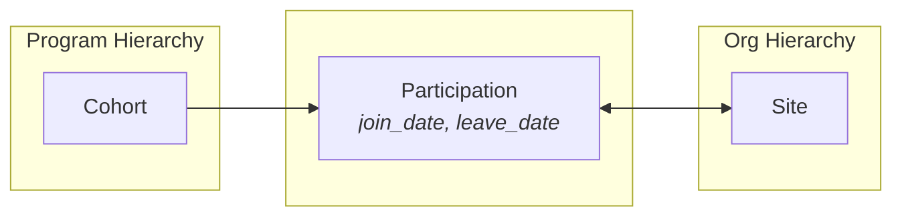
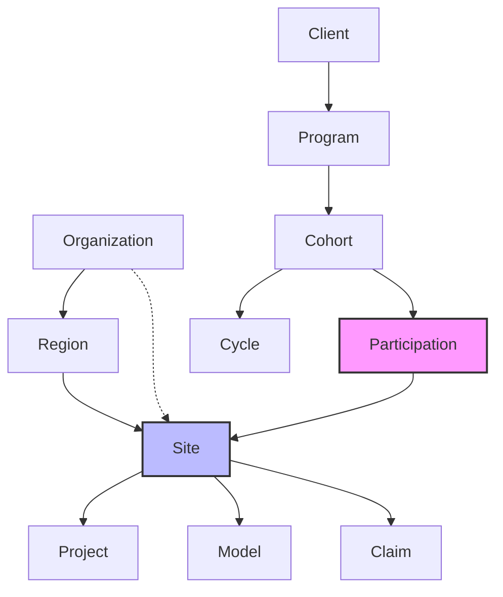

# Dual Hierarchy Authorization Model

This document explains how the two parallel hierarchies work together in the Gazebo authorization system.

## Overview

The system has **two independent hierarchies** that meet at the **Site** level through **Participation**.

## Hierarchy Relationships

### System (Root)
The **System** entity is the root of both hierarchies, representing the entire Gazebo platform.

### Organizational Hierarchy (Phase 1)
This represents the **physical/structural** organization of entities.

| Entity       | Parent(s)              | Description                          |
|--------------|------------------------|--------------------------------------|
| Organization | System                 | Top-level company (e.g., Acme Corp)  |
| Region       | Organization           | Geographic or business division      |
| Site         | Region OR Organization | Physical facility                    |
| Project      | Site                   | Energy project at a site             |
| Model        | Site                   | Energy model for a site              |

### Program Hierarchy (Phase 2)
This represents the **contractual/temporal** organization of program participation.

| Entity        | Parent(s) | Description                              |
|---------------|-----------|------------------------------------------|
| Client        | System    | Funding entity (utility, government)     |
| Program       | Client    | Funded program with specific goals       |
| Cohort        | Program   | Time-bounded group of participants       |
| Cycle         | Cohort    | Reporting period within a cohort         |
| Participation | Cohort    | A site's enrollment in a cohort          |

## The Bridge: Participation

**Participation** is the key entity that connects the two hierarchies:

A **Participation** represents:
- A specific **Site** joining a specific **Cohort**
- Has temporal bounds (join_date, leave_date)
- Enables program-level access to flow down to the participating site

## Permission Flow Examples

### Example 1: Organization Admin
A user with `administrator` role on `Organization:acme` automatically has admin access to:
- All Regions under Acme
- All Sites under those Regions
- All Projects, Models, Claims at those Sites

### Example 2: Program Coordinator
A user with `coordinator` role on `Program:sem-2024` has coordinator access to:
- All Cohorts in SEM 2024
- All Participations in those Cohorts
- All Cycles in those Cohorts
- **Via Participation bridge:** All Sites enrolled in the program

### Example 3: Cohort Facilitator
A user with `facilitator` role on `Cohort:spring-2024` has facilitator access to:
- That specific cohort
- All Participations in that cohort
- All Cycles in that cohort
- **Via Participation bridge:** Only Sites enrolled in Spring 2024

## Visual Summary

## Key Insights

1. **Two entry points**: Users can be granted access via either hierarchy
2. **Meet at Site**: Both hierarchies ultimately control access to Site-level resources
3. **Temporal dimension**: Program hierarchy adds time-bounded access through Cohorts
4. **Flexible bridging**: A Site can participate in multiple Cohorts across different Programs
5. **Inheritance flows down**: Permissions granted at any level flow to all descendants
